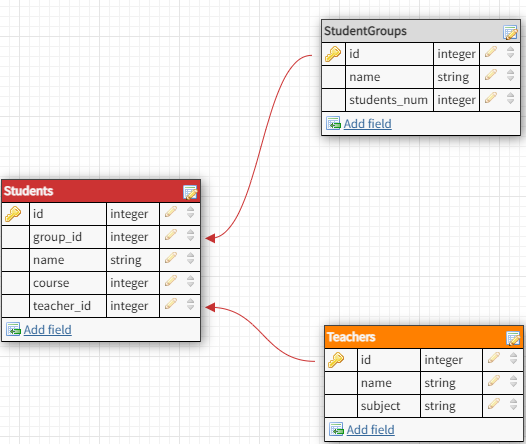

# Student Database Telegram Bot

Данный телеграм бот позволяет управлять базой данных для менеджмента студентов, то есть
есть возможность добовлять их в группы и назначить руководителей с их предметом.

## DataBase:

1) База данных состоит из трех таблиц: Students, StudentGroups, Teachers
2) Она находится в 3ей нормальной форме. Неключевые столбцы зависят от первичного ключа
3) Управление осуществляется через телеграм-бота
4) INDEX был сделан в таблице StudentGroups по полю name, так как по нему производится поиск
5) Триггеры установлены при добавлении и удалении студентов, изменятеся значение в Student Groups students_num

## Functionality

1) Выполнены все критерии к БД

2) Реализован GUI cо всеми 10ю обязательными действиями